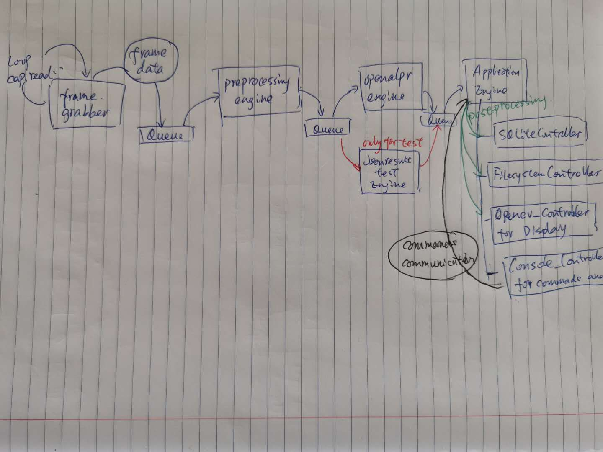

 This is a simple application for real time vehicle plate recognition using cloud API(openalpr), opencv and postgreSQL.


## Version 0.2  

### Overview

The challange with this programme is that frame processing was single threaded and FPS performance was limited by the raw Mhz of single core of the CPU.  
Moreove, there are actually quite a lot of expensive I/O operations, such as network request/response, database operation, filesystem operation and may be GPU inference in the future.
So, I broke up the processing into separate threads and begin processing the next frame before the last frame was finished. 
This enables more work to be done on frames without dropping the frame rate so much and also allows more efficient use of a multi-cored system where there might be many, more power efficient but lower performing cores.

This Python process consists of a set of engines and several controllers for the frame processing pipeline. Each engine or controller runs in its own thread.

### Simple Diagram




## Application engine
The application engine:
- receives the json data based on the image frames from queue buffer
- assesses the detection by checking the plate confidence, the vehicle orientation and filtering wrong plate result for each given json result
- remove the outdated plates list so as to clean the wrong detection results and to avoid other uncertain issues.
- insert key data from the detection result into the sqlite database
- save the image and json result for further review and testing


### Engine component

An engine components is a unit of processing that works on a frame.  
They can be dependant on other components, this is managed by where in the pipeline they are inserted.  
The core engines job is to startup the components and chain them together in the desired order.  
Each engine component gets passed every frame and its the components responsibility to decide if they can process it.  
The abstract component is ```BaseQueueEngine```.   
This manages the core structure of the component and supplies the requirements for participating in the core engines architecture.   
Its starts the thread and runs the ```process``` method that each component should implement.

### Frame Grabber

The frame grabber is not a typical engine, but a producer of frames to the pipeline.  
It does not inherit from ```BaseQueueEngine```.   
It reads the frames from the test video and put each frame to the input queue of preprocessing engine.
It follows the same interface that the engines do but of course lacks a input queue to receive data.  


### Preprocessing Engine

This engines responsibility is to do the image pre-processing before sending it to the detection engine. 
These processes are :
- checking dark images
- checking blurry images
- denoising images
- choosing the right ROI of the images


### Openalpr Engine

This engines responsibility is to detect plates in the frame as the frames pass through the pipe.  
The current API is based on the openalpr cloud API which return a json style result in the https response. 
However, the detection from the cloud is not free.(only free for 50 detections per account).  
So, I save the results of the detection and start to use Jsonresult_testing_engine.

### Json result Testing Engine

This engines responsibility is to read image file and detection result json file from previous saving which is only for easy testing. 
I built another pipeline with this testing engine instead of openalpr engine to speed up my testing and save my credit of my openalpr cloud account.

## Controllers  
There are a set of controllers, each with their own responsibilities:
- insert detection result to sqlite database (sqlite_controller)
- save applicationd images and metadata files to disk (filesystem_controller)
- display a GUI view of the images that are received from the application engine (opencv_controller)
- accept commands typed on the keyboard (console_controller)

Controllers exist in the `controllers` subdirectory of the source tree and they all inherit from either the `engine_controller` or `threaded_engine_controller` abstract base classes.

Controllers are initialized in the `main` entry point in `main.py` and are registered to the application engine's `register_controller()` function.

`EngineController` is the ultimate base class of all controllers and has the following capabilities:
- a reference to the single instance of the application engine.
- a set of `signal` functions that are to be used for posting commands to the application engine. These work by posting a message to the command queue of the application engine.
- a set of `notify` functions that are called by the application engine upon certain events occurring. The notify functions in the base class are empty (no-op) implementations and are designed to be overridden in derived classes.

The above forms an event bus architecture whereby controllers are notified of events (via the `notify` callbacks) and are able to emit events (via the `signal` functions).

`ThreadedEngineController` extends `EngineController` to introduce threading capability.
It overrides the `notify_start` event notification with code to launch a worker thread. The actual implementation of the worker thread must be provided in a `run` function by a derived class.


### Todo:
- SqliteController can be implemented as a db manager with queue for multiple threads insertions.
- Motion blur and denoising can be improved further if I have more time.
- More engines and controllers can be added for a formal application


-------------------------

## Ver 0.1
  
This is the first version which is quite simple and naive, since this application is built from scatch. 

### About the current code
`test_scripts` contains all the simple script when I tried basic functions of sqlite, openalpr and video.
`running_data` is my running cache which saved the temporary json result and frame image for easy testing and debugging purpose.
`test_data` contains the test image file and video file.
main.py 

### TODO:
 - Currently, this app is a single main file with one for loop. So, multiple threads for I/O operation is urgent to be implemented.
 - Concurrency should be considered as well.
 - Object oriented style
 - sqlite and openalpr cloud api can be encapsulated more elegantly.
 - A lot of scenarios haven't been considered: e.g., multiple car/plates, dark/rain/fog/bad condition, robustness, etc.
